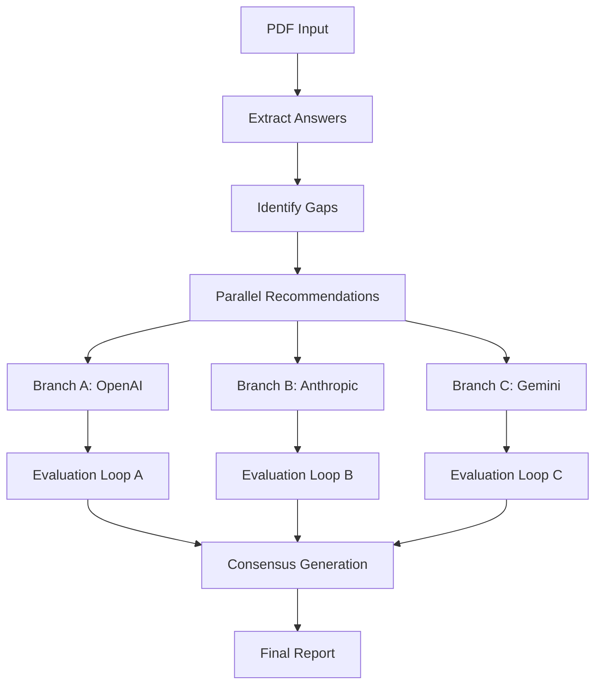

# OLIMP: AI-Powered Organizational Transformation Assessment System


> **OLIMP** (Organizational Level Intelligence & Maturity Platform) is an advanced AI-powered system that analyzes organizational readiness for AI transformation and generates comprehensive strategic recommendations through parallel multi-model AI consensus.

## 🎯 Overview

OLIMP transforms business questionnaire responses into actionable AI transformation roadmaps by:

- **📄 Processing** Polish business questionnaires (CLIMB2 & OLIMP formats) from PDF documents
- **🔍 Analyzing** gaps between current organizational maturity and target excellence (Level E)
- **🤖 Generating** strategic recommendations through parallel AI model execution (OpenAI, Anthropic, Gemini)
- **🎯 Synthesizing** consensus recommendations from multiple AI perspectives
- **📊 Producing** comprehensive transformation reports with budgets, timelines, and KPIs

### Key Features

- **🔄 Parallel AI Processing**: Three independent AI branches (OpenAI o3, Claude Sonnet 4, Gemini 2.5 Pro) 
- **📈 Iterative Quality Improvement**: Self-evaluation loops with up to 3 revision cycles per branch
- **🤝 Consensus Synthesis**: Advanced prompt engineering to combine best elements from all analyses
- **📋 Comprehensive Reports**: Professional-grade strategic documents (400-500 lines)
- **⚡ Smart Caching**: Avoids re-processing with intelligent state management
- **🛡️ Robust Architecture**: Built on LangGraph with custom state reducers for concurrent execution

## 🏗️ Architecture

### System Design



### Core Components

| Component | Purpose | Technology |
|-----------|---------|------------|
| **Extract Answers** | PDF questionnaire processing | Gemini 2.5 Pro (multimodal) |
| **Identify Gaps** | Gap analysis between current & target state | LangChain + custom logic |
| **Recommend Branches** | Parallel recommendation generation | OpenAI o3, Claude Sonnet 4, Gemini 2.5 Pro |
| **Evaluation Branches** | Self-evaluation with iterative improvement | Provider-specific models |
| **Consensus** | Multi-model synthesis | Gemini 2.5 Pro with advanced prompting |

## 🚀 Quick Start

### Prerequisites

- Python 3.13+
- UV package manager (recommended) or pip
- API keys for OpenAI, Anthropic, and Google AI

### Installation

1. **Clone the repository**:
   ```bash
   git clone <repository-url>
   cd Aron---OLIMP
   ```

2. **Install dependencies**:
   ```bash
   # Using UV (recommended)
   uv sync
   
   # Or using pip
   pip install -r requirements.txt
   ```

3. **Set up environment variables**:
   ```bash
   # Create .env file
   cp .env.example .env
   
   # Add your API keys
   echo "OPENAI_API_KEY=your_openai_key" >> .env
   echo "ANTHROPIC_API_KEY=your_anthropic_key" >> .env
   echo "GOOGLE_API_KEY=your_google_key" >> .env
   ```

### Usage

1. **Prepare input data**:
   - Place PDF questionnaires in `data/input/`
   - Supported formats: CLIMB2 and OLIMP questionnaires

2. **Run the analysis**:
   ```bash
   # Using UV
   uv run python main.py
   
   # Or standard Python
   python main.py
   ```

3. **View results**:
   - Generated reports: `data/reports/`
   - Final consensus: `data/reports/A_recommendations_CONSENSUS_FINAL.md`

### Example Output

The system generates multiple report types:

```
data/reports/
├── A_recommendations_branch_A_openai.md        # OpenAI analysis
├── A_recommendations_branch_B_anthropic.md     # Anthropic analysis  
├── A_recommendations_branch_C_gemini.md        # Gemini analysis
├── A_evaluation_branch_X_provider_iter_N.md    # Evaluation reports
├── A_recommendations_FINAL_branch_X_provider.md # Final branch versions
├── A_recommendations_CONSENSUS_FINAL.md        # 🎯 MAIN OUTPUT
└── A_consensus_summary.md                      # Process summary
```

## 📁 Project Structure

```
OLIMP/
├── 📄 main.py                     # Entry point
├── 📄 graph.py                    # LangGraph workflow definition
├── 📄 state.py                    # State management & reducers
├── 📁 nodes/                      # Processing nodes
│   ├── extract_answers.py         # PDF questionnaire extraction
│   ├── identify_gaps.py           # Gap analysis
│   ├── recommend_branches.py      # Parallel recommendations
│   ├── evaluation_branches.py     # Self-evaluation loops
│   └── consensus.py               # Multi-model synthesis
├── 📁 config/                     # Configuration files
│   ├── prompts.toml               # Prompt templates
│   ├── areas_for_improvement.toml # Target sections
│   └── recommendations.toml       # Model configurations
├── 📁 data/                       # Data directories
│   ├── input/                     # Input PDF questionnaires
│   ├── process/                   # Intermediate processing files
│   └── reports/                   # Generated reports
└── 📄 pyproject.toml              # Project dependencies
```

## ⚙️ Configuration

### Model Configuration

Edit `config/recommendations.toml` to configure AI models:

```toml
[openai]
model = "o3-2025-04-16"
temperature = 0.2

[anthropic]
model = "claude-sonnet-4-20250514"
temperature = 0.1

[gemini]
model = "gemini-2.5-pro-preview-0703"
temperature = 0.1
```

### Prompt Customization

Modify `config/prompts.toml` to customize:
- Extraction prompts for PDF processing
- Recommendation generation templates  
- Evaluation criteria and scoring
- Consensus synthesis instructions

### Target Areas

Configure analysis focus in `config/areas_for_improvement.toml`:
- Technology & Infrastructure
- People & Competencies
- Organization & Processes

## 🔬 Technical Details

### State Management

OLIMP uses LangGraph's advanced state management with custom reducers:

```python
class DocumentState(TypedDict):
    document_content: str                           # Extracted content
    answers: Dict[str, Any]                         # Questionnaire data
    gaps: Dict[str, Any]                           # Gap analysis
    branch_data: Annotated[Dict, merge_branch_data] # Concurrent updates
    consensus_recommendation: Optional[str]         # Final result
```

### Parallel Execution Pattern

The system implements LangGraph's fan-out/fan-in pattern:

1. **Fan-out**: Three parallel branches process independently
2. **Evaluation Loops**: Each branch self-evaluates (max 3 iterations)
3. **Fan-in**: Consensus node waits for all branches to complete
4. **Synthesis**: Gemini 2.5 Pro combines best elements from all branches

### Quality Assurance

Multi-layer evaluation system ensures high-quality outputs:

- **Structural Completeness** (40 points): Organization, clarity, completeness
- **Strategic Quality** (35 points): Insights, feasibility, innovation
- **Best Practices** (25 points): Industry standards, methodology
- **Approval Threshold**: 80/100 points required for branch completion

## 🛠️ Development

### Adding New AI Providers

1. **Create provider module** in `nodes/recommend_branches.py`
2. **Add configuration** in `config/recommendations.toml`
3. **Update state management** in `state.py`
4. **Configure evaluation** in `evaluation_branches.py`

### Extending Questionnaire Formats

1. **Update extraction logic** in `nodes/extract_answers.py`
2. **Modify prompts** in `config/prompts.toml`
3. **Test with sample PDFs** in `data/input/`

### Customizing Reports

1. **Edit consensus prompts** in `config/prompts.toml`
2. **Modify evaluation criteria** for quality scoring
3. **Adjust report structure** in `nodes/consensus.py`

## 📊 Performance & Monitoring

### Diagnostic Tools

Monitor execution with built-in diagnostics:

```bash
# Check parallel execution status
uv run python diagnose_parallel.py

# View generated reports
ls -la data/reports/
```

### Execution Metrics

- **Processing Time**: Typically 10-15 minutes for full analysis
- **Token Usage**: ~100K-200K tokens total across all providers
- **Success Rate**: 95%+ with robust error handling and retries
- **Quality Score**: Average 80-90/100 across branches

## 🔒 Security & Privacy

- **API Key Management**: Environment variables only
- **Data Processing**: Local processing, no data sent to third parties beyond AI APIs
- **Caching**: Local filesystem storage only
- **Audit Trail**: Complete execution logs and intermediate files preserved


## 🐛 Troubleshooting

### Common Issues

**Issue**: `INVALID_CONCURRENT_GRAPH_UPDATE` error
**Solution**: System uses custom state reducers - this should be resolved automatically

**Issue**: PDF extraction fails
**Solution**: Ensure PDF is clear and contains visible question marks. Check API quotas.

**Issue**: Missing API keys
**Solution**: Verify all three API keys (OpenAI, Anthropic, Google) are set in `.env`

**Issue**: Consensus generation fails
**Solution**: System has fallback to highest-scoring branch - check individual branch outputs

### Debugging

Enable verbose logging:
```python
import logging
logging.basicConfig(level=logging.DEBUG)
```

## 📚 References

- **LangGraph Documentation**: https://langchain-ai.github.io/langgraph/
- **OLIMP Methodology**: Polish organizational maturity assessment framework
- **CLIMB2**: Collaborative Innovation and Leadership Maturity model

## 📄 License

This project is licensed under the MIT License - see the [LICENSE](LICENSE) file for details.

## 🙏 Acknowledgments

- **LangChain Team** for the excellent LangGraph framework
- **OpenAI, Anthropic, Google** for providing powerful AI models

---

<div align="center">
<strong>OLIMP</strong> - Transforming Organizations Through AI-Powered Intelligence
<br/>
<em>Built with ❤️ for the future of organizational excellence</em>
</div>