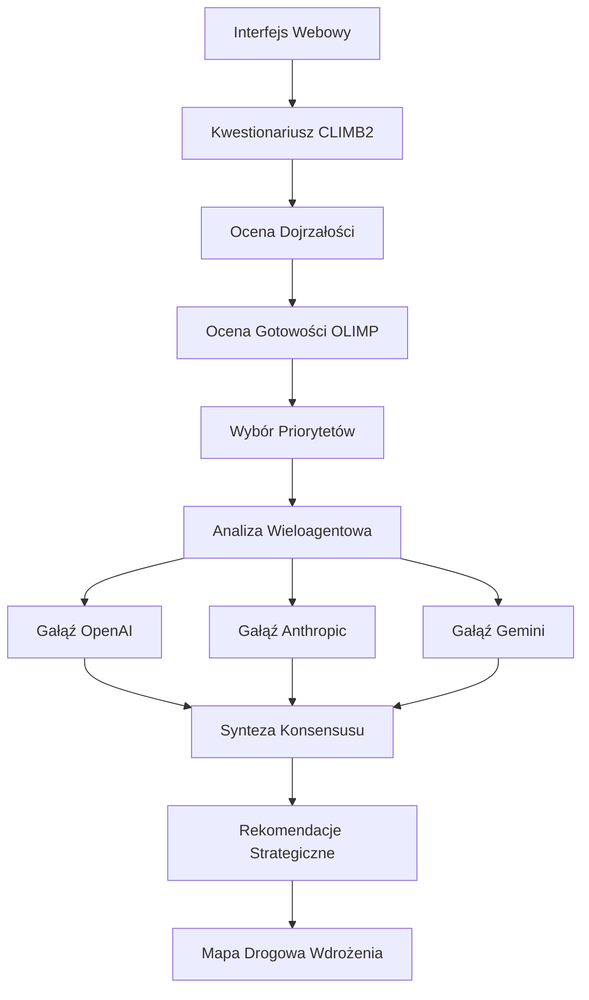

# CLIMB2OLIMP: System Oceny Transformacji Organizacyjnej Oparty na AI


> **CLIMB2OLIMP** to kompleksowy system oparty na sztucznej inteligencji do oceny gotowości organizacyjnej na transformację AI, opracowany jako kod uzupełniający do badań naukowych nad wieloagentowymi systemami AI w analizie organizacyjnej.

## 🎯 Przegląd

Repozytorium zawiera kompletną implementację wieloetapowej platformy oceny gotowości organizacji do wdrozeń systemów AI, która łączy dwie komplementarne metodologie:

- **CLIMB2** (Collaborative Innovation and Leadership Maturity): Podstawowa ocena dojrzałości organizacyjnej
- **OLIMP** (Organizational Level Intelligence & Maturity Platform): Zaawansowana analiza luk i rekomendacje strategiczne oparte na AI

System demonstruje praktyczne zastosowanie wieloagentowych architektur AI w doradztwie organizacyjnym, wykorzystując przetwarzanie równoległe przez wiele dużych modeli językowych do generowania rekomendacji strategicznych opartych na konsensusie.

## 🔬 Kontekst Naukowy

Kod źródłowy służy jako implementacja techniczna wspierająca badania nad:

- **Wieloagentowymi Systemami AI**: Równoległe wykonywanie modeli AI (OpenAI, Anthropic, Gemini) z syntezą konsensusu
- **Oceną Dojrzałości Organizacyjnej**: Cyfrowa transformacja tradycyjnych metodologii doradczych
- **Współpracą Człowiek-AI**: Projektowanie interaktywnych przepływów pracy dla złożonej analizy organizacyjnej
- **Planowaniem Strategicznym Opartym na AI**: Automatyczne generowanie wykonalnych map drogowych transformacji

## 🏗️ Architektura Systemu

### Przepływ Wysokiego Poziomu



### Architektura Komponentów

| Komponent | Technologia | Cel |
|-----------|-------------|-----|
| **Frontend** | Next.js 15.2, React 19, TypeScript | Interaktywny interfejs webowy dla kwestionariuszy i wyników |
| **Backend** | Python 3.13, LangGraph, FastAPI | Warstwa API i orkiestracja przepływu pracy |
| **Silnik OLIMP** | LangGraph, Multi-LLM | Zaawansowana analiza AI z przetwarzaniem równoległym |
| **Warstwa Usług** | PM2, SystemD | Wdrożenie produkcyjne i zarządzanie procesami |

## 🚀 Przepływ Badawczy

### Etap 1: Ocena Podstawowa (CLIMB2)
- **Ocena Dojrzałości Organizacyjnej**: 8 kluczowych kategorii obejmujących współpracę, szkolenia, procesy i technologię
- **Punktacja Ilościowa**: Ocena poziomowa (skala A-E) w wielu wymiarach
- **Identyfikacja Luk**: Systematyczna analiza stanu obecnego vs. docelowego

### Etap 2: Ocena Gotowości na AI (OLIMP)
- **Gotowość na Generatywną AI**: Specyficzna ocena zdolności transformacji AI
- **Ustalanie Priorytetów Strategicznych**: Wybór obszarów fokusowych kierowany przez użytkownika
- **Analiza Multimodalna**: Integracja danych kwestionariusza z kontekstem organizacyjnym

### Etap 3: Wieloagentowa Analiza Strategiczna
- **Przetwarzanie Równoległe**: Trzy niezależne gałęzie AI analizują dane organizacyjne
- **Iteracyjne Doskonalenie**: Pętle samooceny z punktacją jakości (próg 80+)
- **Generowanie Konsensusu**: Zaawansowane inżynieria promptów do syntezy rekomendacji

### Etap 4: Rekomendacje Strategiczne
- **Kompleksowe Raporty**: 400-500 liniowe dokumenty strategiczne z budżetami i harmonogramami
- **Mapy Drogowe Wdrożenia**: Fazowe plany transformacji z KPI
- **Ocena Ryzyka**: Identyfikacja potencjalnych wyzwań i strategii mitygacji

## 📊 Kluczowe Funkcje

### Przetwarzanie Wieloagentowe AI
- **Wykonywanie Współbieżne**: Trzy modele AI przetwarzają dane jednocześnie
- **Zapewnienie Jakości**: Automatyczna ocena z iteracyjnym doskonaleniem
- **Synteza Konsensusu**: Inteligentne łączenie różnorodnych perspektyw AI
- **Solidna Obsługa Błędów**: Mechanizmy zapasowe i logika ponownych prób

### Interaktywne Doświadczenie Użytkownika
- **Progresywne Ujawnianie**: Wieloetapowy przepływ pracy z jasnymi wskaźnikami postępu
- **Informacje w Czasie Rzeczywistym**: Monitorowanie postępu na żywo podczas analizy AI
- **Responsywny Design**: Interfejs przyjazny dla urządzeń mobilnych z funkcjami dostępności
- **Integracja Przykładowych Danych**: Szybka demonstracja z wstępnie załadowanymi przykładami

### Wdrożenie Gotowe na Produkcję
- **Zarządzanie Usługami**: Zarządzanie procesami oparte na PM2 z automatycznym restartem
- **Logowanie i Monitorowanie**: Kompleksowe logowanie ze śledzeniem błędów
- **Skalowalna Architektura**: Modularny design wspierający skalowanie horyzontalne
- **Bezpieczeństwo**: Konfiguracja oparta na środowisku z zarządzaniem kluczami API

## 📁 Struktura Repozytorium

```
CLIMB2OLIMP/
├── 📁 frontend/                    # Aplikacja webowa Next.js
│   ├── src/app/                    # Strony aplikacji i routing
│   ├── src/components/             # Komponenty UI do wielokrotnego użytku
│   ├── src/utils/                  # Funkcje narzędziowe i tłumaczenia
│   └── src/types/                  # Definicje typów TypeScript
├── 📁 backend/                     # Python API i silnik przepływu pracy
│   ├── graph/                      # Definicje przepływu pracy LangGraph
│   ├── config/                     # Konfiguracja i prompty
│   ├── data/                       # Dane kwestionariusza i wyniki
│   └── utils/                      # Współdzielone narzędzia
├── 📁 OLIMP/                       # Zaawansowany silnik analizy AI
│   ├── nodes/                      # Węzły przetwarzania dla przepływu pracy AI
│   ├── config/                     # Konfiguracje modeli AI i prompty
│   └── data/                       # Dane wejściowe analizy i wygenerowane raporty
├── 📄 ecosystem.config.js          # Konfiguracja usługi PM2
├── 📄 manage-services.sh           # Skrypty zarządzania usługami
└── 📄 SERVICE_SETUP.md            # Przewodnik wdrożenia produkcyjnego
```

## 🔄 Przepływ Danych

### Przetwarzanie Wejściowe
1. **Kwestionariusze Użytkownika**: Ocena organizacyjna CLIMB2 (8 kategorii, 40+ pytań)
2. **Ocena OLIMP**: Kwestionariusz gotowości na AI z wyborem priorytetów
3. **Kontekst Strategiczny**: Obszary fokusowe i cele organizacyjne zdefiniowane przez użytkownika

### Pipeline Przetwarzania AI
1. **Ekstrakcja Danych**: Strukturalne parsowanie odpowiedzi kwestionariusza
2. **Analiza Luk**: Systematyczna identyfikacja możliwości poprawy
3. **Rekomendacje Równoległe**: Trzy modele AI generują niezależne analizy
4. **Ocena Jakości**: Automatyczna punktacja i iteracyjne doskonalenie
5. **Synteza Konsensusu**: Inteligentne łączenie najlepszych elementów

### Generowanie Wyników
1. **Raporty Strategiczne**: Kompleksowe dokumenty markdown z wykonalnymi spostrzeżeniami
2. **Plany Wdrożenia**: Fazowe mapy drogowe z harmonogramami i budżetami
3. **Śledzenie Postępu**: Aktualizacje statusu w czasie rzeczywistym podczas analizy
4. **Możliwości Eksportu**: Wsparcie wielu formatów do dalszej analizy

## 🎯 Zastosowania Badawcze

### Nauki Organizacyjne
- **Studia Transformacji Cyfrowej**: Ilościowa ocena gotowości na AI
- **Badania Zarządzania Zmianą**: Systematyczne podejście do ewolucji organizacyjnej
- **Walidacja Modeli Dojrzałości**: Empiryczne testowanie ram oceny

### Badania Systemów AI
- **Architektury Wieloagentowe**: Praktyczna implementacja równoległego przetwarzania AI
- **Mechanizmy Konsensusu**: Nowatorskie podejścia do syntezy opinii AI
- **Interakcja Człowiek-AI**: Projektowanie przepływu pracy dla złożonych zadań analitycznych

### Business Intelligence
- **Automatyzacja Planowania Strategicznego**: Generowanie strategii transformacji kierowane przez AI
- **Ocena Ryzyka**: Systematyczna identyfikacja wyzwań implementacyjnych
- **Pomiar Wydajności**: Rozwój KPI dla inicjatyw transformacyjnych

## 📈 Metryki Wydajności

### Wydajność Systemu
- **Czas Przetwarzania**: 10-15 minut dla kompletnej analizy
- **Efektywność Tokenów**: 100K-200K tokenów we wszystkich dostawcach AI
- **Wskaźnik Sukcesu**: 95%+ wskaźnik ukończenia z solidną obsługą błędów
- **Wyniki Jakości**: Średnio 80-90/100 w gałęziach AI

### Walidacja Badawcza
- **Spójność**: Wysoka zgodność między modelami w kluczowych rekomendacjach
- **Kompletność**: Kompleksowe pokrycie wymiarów organizacyjnych
- **Wykonalność**: Konkretne, mierzalne rekomendacje z jasnymi harmonogramami
- **Realizowalność**: Realistyczne plany wdrożenia w ramach ograniczeń organizacyjnych

---

## 🛠️ Konfiguracja Techniczna

### Wymagania Wstępne

- **Python 3.13+** z menedżerem pakietów UV
- **Node.js 18+** z npm/yarn
- **Klucze API**: OpenAI, Anthropic, Google AI
- **System**: Linux/macOS (Windows z WSL)

### Szybki Start

1. **Klonowanie Repozytorium**:
   ```bash
   git clone <repository-url>
   cd CLIMB2OLIMP
   ```

2. **Konfiguracja Środowiska**:
   ```bash
   # Zależności backendu
   cd backend && uv sync && cd ..
   
   # Zależności frontendu
   cd frontend && npm install && cd ..
   
   # Zależności OLIMP
   cd OLIMP && uv sync && cd ..
   ```

3. **Konfiguracja**:
   ```bash
   # Tworzenie plików środowiska
   cp backend/.env.example backend/.env
   cp OLIMP/.env.example OLIMP/.env
   
   # Dodawanie kluczy API
   echo "OPENAI_API_KEY=twoj_klucz" >> backend/.env
   echo "ANTHROPIC_API_KEY=twoj_klucz" >> backend/.env
   echo "GOOGLE_API_KEY=twoj_klucz" >> OLIMP/.env
   ```

4. **Uruchomienie Systemu**:
   ```bash
   # Start usług z PM2
   ./setup-service.sh
   
   # Lub ręczny tryb deweloperski
   cd frontend && npm run dev &
   cd backend && uv run python main.py &
   ```

5. **Dostęp do Aplikacji**:
   - Interfejs Webowy: http://localhost:3001
   - Zarządzanie Usługami: `./manage-services.sh status`

### Przepływ Pracy Deweloperskiej

1. **Rozwój Frontendu**:
   ```bash
   cd frontend
   npm run dev          # Serwer deweloperski
   npm run build        # Build produkcyjny
   npm run lint         # Sprawdzanie jakości kodu
   ```

2. **Rozwój Backendu**:
   ```bash
   cd backend
   uv run python main.py              # Start serwera API
   uv run python debug_status.py      # Narzędzia debugowania
   ```

3. **Analiza OLIMP**:
   ```bash
   cd OLIMP
   uv run python main.py              # Analiza standalone
   uv run python diagnose_parallel.py # Debug wykonywania równoległego
   ```

### Wdrożenie Produkcyjne

1. **Konfiguracja Usługi**:
   ```bash
   # Instalacja PM2 globalnie
   npm install -g pm2
   
   # Konfiguracja usługi systemowej
   ./setup-service.sh
   
   # Konfiguracja auto-startu
   pm2 startup systemd
   pm2 save
   ```

2. **Monitorowanie**:
   ```bash
   # Status usługi
   ./manage-services.sh status
   
   # Przeglądanie logów
   ./manage-services.sh logs
   
   # Monitorowanie wydajności
   pm2 monit
   ```

3. **Konserwacja**:
   ```bash
   # Aktualizacja zależności
   cd backend && uv sync
   cd frontend && npm update
   
   # Restart usług
   ./manage-services.sh restart
   ```

### Opcje Konfiguracji

#### Konfiguracja Modeli AI (`OLIMP/config/recommendations.toml`)
```toml
[openai]
model = "o3-2025-04-16"
temperature = 0.2

[anthropic]
model = "claude-sonnet-4-20250514"
temperature = 0.1

[gemini]
model = "gemini-2.5-pro-preview-0703"
temperature = 0.1
```

#### Dostosowywanie Promptów (`backend/config/prompts.json`, `OLIMP/config/prompts.toml`)
- Prompty przetwarzania kwestionariusza
- Szablony analizy i rekomendacji
- Kryteria oceny i rubryki punktacji
- Instrukcje syntezy konsensusu

#### Konfiguracja Usługi (`ecosystem.config.js`)
- Ustawienia zarządzania procesami
- Limity pamięci i auto-restart
- Konfiguracja logowania
- Zmienne środowiskowe

### Rozwiązywanie Problemów

#### Częste Problemy

**Frontend się nie ładuje**:
```bash
# Sprawdzenie statusu usługi
./manage-services.sh status

# Restart frontendu
./manage-services.sh restart

# Sprawdzenie logów
./manage-services.sh logs
```

**Błędy API backendu**:
```bash
# Weryfikacja środowiska Python
cd backend && uv run python --version

# Sprawdzenie zależności
uv sync

# Test endpointów API
curl http://localhost:3001/api/questionnaire
```

**Niepowodzenia analizy OLIMP**:
```bash
# Weryfikacja kluczy API
cd OLIMP && cat .env

# Sprawdzenie dostępności modeli
uv run python debug_llm.py

# Monitorowanie wykonywania równoległego
uv run python diagnose_parallel.py
```

#### Tryb Debugowania

Włączenie szczegółowego logowania:
```bash
# Debugowanie backendu
cd backend
export DEBUG=true
uv run python main.py

# Debugowanie OLIMP
cd OLIMP
export LOG_LEVEL=DEBUG
uv run python main.py
```

---

## 📚 Bibliografia

- **Framework LangGraph**: https://langchain-ai.github.io/langgraph/
- **Metodologia CLIMB2**: Ocena Dojrzałości Współpracy, Innowacji i Przywództwa
- **Framework OLIMP**: Platforma Inteligencji i Dojrzałości Organizacyjnej
- **Systemy Wieloagentowe**: Rozproszona AI dla Rozwiązywania Złożonych Problemów

## 📄 Licencja

Ten projekt jest licencjonowany na licencji MIT - zobacz plik [LICENSE](LICENSE) dla szczegółów.

## 🙏 Podziękowania

- **Zespół LangChain** za doskonały framework LangGraph
- **OpenAI, Anthropic, Google** za dostarczenie potężnych modeli AI
- **Społeczność Badawcza** za rozwój wieloagentowych systemów AI

---

<div align="center">
<strong>CLIMB2OLIMP</strong> - Rozwój Inteligencji Organizacyjnej przez Wieloagentową AI
<br/>
<em>Wspieranie badań w transformacji organizacyjnej kierowanej przez AI</em>
</div>
